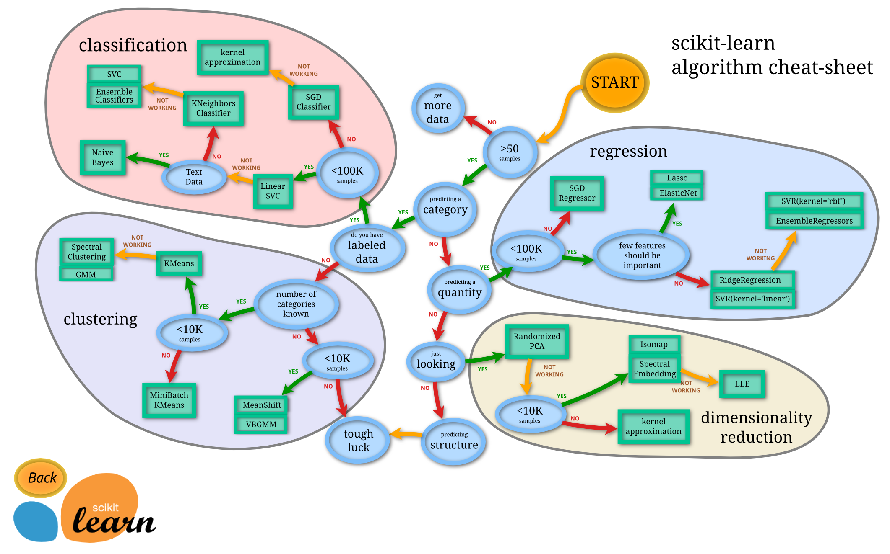

# DanzDSTools

This repo cantained basic tools for data science.

## follow the sklean_roadmap

## SQL tools : 
- connect_to_mysql
- send_statement
- get_tables
- get_columns
- get_table_as_df
- get_quarry

## EDA tools :

Basic EDA workflow

get_numerical_categorical - basic separation for numerial/ categorical features

tools for assumptions testing (all_values_in_list and all_values_in_range)

plotting functions
 - multi numerical box
 - multi numerical EDA
 - multi categorical coutplot
 - multi numerical corr
 - one numerical multi categorical KDA
 - numerical + categorical bars
 - numerical + numerical scatter
 - categorical + categorical 

## Preprossesing tools - working progress :

## Feature engineering : 

 - feature selection
 - Dimensionlity Reduction with PCA
 - 

## Modle selection :

 - cross validation
 - grid search
 - random search

##  Classification tools : 

 - roc curve
 - confusion matrix
 - simple random forest classifier
 
## Regression tools :

 - Linear Regresion
 - Polyunomial Regression
 - print metrics
 
## Unsupervised learning :

 - number clusters (Elbow method)
 - print clusters on 2 PCA
 - Anomaly detection (local outlier and Isolation forest)

## Time_Series - working progress :

 - A walkthrough on solving a time series problem.
 - ARIMA model
 - results evaluation